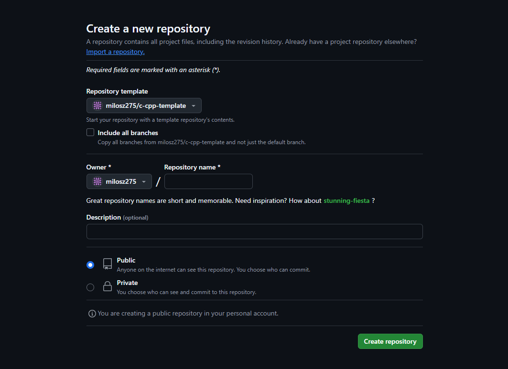
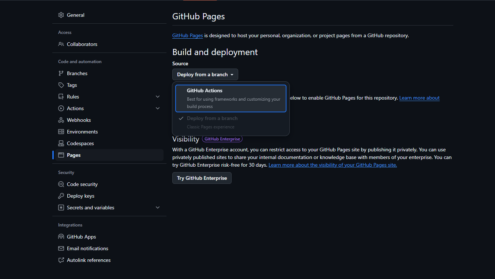
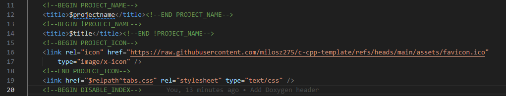

# C/C++ Project Template

This is a template for C/C++ projects. It includes a Makefile for building either C or C++, a directory structure for organizing the source code, and a README.md file for documenting the project.

## Table of Contents

- [Getting Started](#getting-started)
- [Build](#build)
- [Adjustments](#adjustments)
  - [Adding new directories](#adding-new-directories)
  - [Choosing C/C++](#choosing-cc)
  - [Doxygen Docs](#doxygen-docs)
- [License](#license)

## Getting Started

To use this template click "Use this template" and create a new repository or open the template in a codespaces [or use this template here](https://github.com/new?template_name=c-cpp-template&template_owner=milosz275).

After the repository is recreated, please modify repo settings in order to GitHub Pages docs deploy workflow succeed. Select GitHub Actions as a source for build and deployment.

> [!IMPORTANT]
> Even if your repository is private, deployed docs will be available publicly.

## Build

Repository comes ready with out-of-the-box options for Makefile as well as CMake. Feel free to remove one that you won't need.

## Adjustments

### Adding new directories

Edit main [Makefile](https://github.com/milosz275/c-cpp-template/blob/main/Makefile) for build-ignored directories. Each other new directory is required to have Makefile. CMake is building project-name directory at this moment.

### Choosing C/C++

You cannot use both C and C++ at the same time using this template. Choose proper file format in the [project Makefile](https://github.com/milosz275/c-cpp-template/blob/main/project-name/Makefile) and adjust input files in the [Doxyfile](https://github.com/milosz275/c-cpp-template/blob/main/Doxyfile).

### Doxygen Docs

Adjust Doxygen Documentation page icon in [header.html](https://github.com/milosz275/c-cpp-template/blob/main/header.html) file in line 16.

## License

This project is licensed under the MIT License - see the [LICENSE](https://github.com/milosz275/c-cpp-template/blob/main/LICENSE) file for details.
